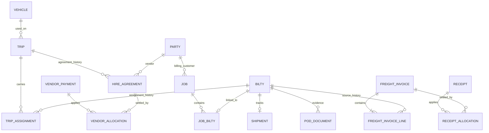

# Transport operations — proposed backend low-level design

Date: 30 September 2026. Status: **Draft proposal for review; not implemented.**

This document translates the [BiltyBook feature-gap review](../reviews/2026-09-30-biltybook-feature-gap.md) into proposed backend changes for our Bilty application. It provides a technical basis for designing booking, dispatch, POD, billing and settlement together. Competitor observations establish visible features, not verified backend behavior. The design below is our recommendation.

The current [PRD](../prd.md) and [field contract](../fields.md) remain the implemented V1 baseline. This document does not expand that baseline automatically. No production migration or application behavior changes accompany it.

## 1. Scope and architecture choice

Recommended: extend the existing NestJS modular application and PostgreSQL database. Keep transactional operations in one database and reuse authenticated tenant access. A separate microservice system would add deployment and consistency work before the workflows are established. Adding every new feature to the bilty JSONB document would make financial history and independent shipment updates too tightly coupled to printable documents.

Proposed modules:

| Module          | Responsibility                                                      |
| --------------- | ------------------------------------------------------------------- |
| Party / vehicle | Reusable customer, vendor, owner and vehicle details                |
| Operations      | Jobs, shipment progress, trips and assignments                      |
| Hiring          | Vehicle hire agreements, agreed charges and vendor liability        |
| POD             | Delivery evidence, review and submission history                    |
| Billing         | Customer freight invoices, numbering and immutable issued snapshots |
| Settlement      | Receipts, vendor payments, allocations and reversals                |
| Expenses        | Itemised operating costs and their settlement                       |
| Reporting       | Registers, outstanding balances, aging and operational summaries    |

Keep the existing bilty, auth, company and print modules. Use synchronous service calls for database invariants; introduce durable background processing only for file processing, large exports and explicitly enabled notifications.

### Recommended starting assumptions

- INR only; amounts use exact integer paise.
- A job belongs to one billing customer and can contain several bilties.
- A trip can carry several bilties from different jobs. Initially, a bilty has at most one active trip assignment. Split loads, transshipment and multiple delivery legs require a later model extension.
- A trip has one active hire agreement. Owned vehicles have operating expenses but no artificial vendor freight payable.
- Customer freight is agreed per bilty. Job totals are derived; a job-wide quote must be explicitly distributed before invoicing.
- A freight invoice can combine issued bilties for the same billing customer. Initial billing supports one full freight charge per bilty, not staged or split invoices.
- Posting and reversing money is initially admin-only. Employees can perform operational work.

These are proposed defaults, especially the full-load/part-load assumptions. Confirm them against actual daily work before implementing dependent modules.

## 2. Existing contracts to preserve

Relevant current sources:

- [Shared types](../../packages/shared-types/src/index.ts)
- [Bilty service](../../apps/api/src/modules/bilty/bilty.service.ts), [validation](../../apps/api/src/modules/bilty/validation.ts) and [money](../../apps/api/src/modules/bilty/money.ts)
- [Live transactional authorization](../../apps/api/src/modules/auth/access.ts)
- [HTTP contracts](../../apps/api/src/http/contracts.ts)
- [Database migrations](../../apps/api/src/database/migrations/)
- [PDF shares](../../apps/api/src/modules/print/share.service.ts)

Preserve the following:

1. Bilty document status stays `draft | issued | cancelled`. Shipment status is separate.
2. Existing `PUT` requires the full nested document and an expected version. Do not introduce ambiguous partial changes through that endpoint.
3. Goods invoice references and e-way references stay within the validated, audited bilty aggregate. They are not freight invoices.
4. Issuing keeps atomic numbering and frozen company snapshots. Issued edits require reasons and retain history.
5. Public PDF links continue to reference fixed issued versions; cancellation invalidates them. POD files do not inherit this public access mechanism.
6. Actor/company identity comes from authentication and live membership checks, never request-body fields.
7. TypeORM schema synchronization stays disabled. Schema changes use explicit migrations.
8. Existing `paid`, `to-pay` and `billed` values describe freight terms. None proves that a payment occurred.

## 3. Relationships



Historical links may be many; active-link constraints below enforce the narrower first-release rules. All relationships are tenant scoped.

## 4. Storage conventions

Every new tenant-owned table has `id uuid`, `company_id uuid`, `created_at timestamptz` and `created_by uuid`. Mutable aggregates also have `version integer > 0`, `updated_at`, and `updated_by`. Include `UNIQUE(company_id, id)` and composite foreign keys `(company_id, foreign_id)` to prevent cross-tenant links even if service code is wrong.

Use `date` for business dates, UTC timestamps for events, and explicit company-local dates for daily reports. Start with Asia/Kolkata as the documented reporting default. Money columns use `bigint` with nonnegative checks and the current per-document bound of `99,999,999,999` paise. Validate calculated totals against that bound too. PostgreSQL driver conversion must be explicit: bounded document values can use safe JSON numbers; potentially large report aggregates return decimal strings, with that distinction declared in shared types.

Archive reusable masters. Retain posted documents and transactions. Do not cascade-delete financial history. Store snapshots of names, addresses, tax identifiers and relevant terms when a commercial document becomes binding; master changes must not rewrite historical documents.

### 4.1 Masters and jobs

| Table                | Important fields                                                                                                                                                                      | Constraints / indexes                                                                  |
| -------------------- | ------------------------------------------------------------------------------------------------------------------------------------------------------------------------------------- | -------------------------------------------------------------------------------------- |
| `party_roles`        | `party_id`, `role` = consignor / consignee / customer / vendor                                                                                                                        | Unique tenant + party + role; role validation                                          |
| `party_details`      | `party_id`, `pan`, `city`, `version`                                                                                                                                                  | One per party; optional values; no name-based deduplication                            |
| `vehicles`           | `registration_normalized`, `display_registration`, `ownership` = owned / hired, `owner_party_id`, default driver name/phone, `archived_at`                                            | Unique tenant + normalized registration; owner must have vendor role for hired use     |
| `jobs`               | `reference`, `billing_party_id`, `booking_date`, `origin`, `destination`, `purchase_order_ref`, `unloading_address`, `expected_delivery_date`, `state` = open / completed / cancelled | Unique tenant + reference; indexes tenant + booking date and tenant + customer + state |
| `job_biltys`         | `job_id`, `bilty_id`                                                                                                                                                                  | Unique tenant + bilty; index tenant + job                                              |
| `freight_agreements` | `bilty_id`, `billing_party_id`, `customer_snapshot`, `calculation`, `charge_lines`, `total_paise`, `state` = draft / confirmed, `version`                                             | One current agreement per bilty; complete before billing; revision history in audit    |

The existing party `kind` is currently one consignor/consignee value. Expand safely: backfill corresponding roles, retain the old endpoint and column for legacy clients, and add a versioned roles-aware API. Old creates populate both representations. The old `kind` remains a compatibility role; new role edits may not remove it while legacy clients are supported. Do not merge existing parties by name or GSTIN automatically. Vendor-only creation uses the new contract and requires an explicit nullable-kind migration plus legacy list filtering; do not invent a consignee role for a vendor.

New operational bilties require a job link before dispatch. Historical bilties remain readable without jobs. A job cannot mix billing customers. Job completion means every shipment is delivered or explicitly cancelled; it does not mean invoices are paid or POD is submitted. Reopening requires an audited reason.

The freight agreement is the commercial source for future transport invoices. Existing bilty charges remain the printable document snapshot. Offer an explicit command to copy them into an agreement draft, recording the source bilty version. Later edits never silently synchronize the two. Show disagreements for review. Once invoiced, the billed agreement version is immutable; financial corrections use adjustment workflows.

### 4.2 Trips, hiring and shipment events

| Table                   | Important fields                                                                                                                                        | Constraints / indexes                                                                           |
| ----------------------- | ------------------------------------------------------------------------------------------------------------------------------------------------------- | ----------------------------------------------------------------------------------------------- |
| `trips`                 | `reference`, `vehicle_id`, vehicle/driver snapshot, route, planned/actual departure and arrival, `state` = planned / dispatched / completed / cancelled | Unique tenant + reference; tenant + state + departure index                                     |
| `trip_assignments`      | `trip_id`, `bilty_id`, `assigned_at`, `released_at`, release reason                                                                                     | Partial unique tenant + bilty where unreleased; retain history                                  |
| `hire_agreements`       | `trip_id`, `vendor_party_id`, vendor snapshot, charge breakdown, `total_paise`, `state` = draft / confirmed / voided, `superseded_at`                   | One active confirmed agreement per trip; confirmed changes require explicit amendment history   |
| `hire_cost_allocations` | `hire_agreement_id`, `bilty_id`, `amount_paise`                                                                                                         | Unique agreement + bilty; allocated total cannot exceed hire total; lock agreement when writing |
| `shipments`             | `bilty_id`, `status`, expected/actual delivery timestamps, `version`                                                                                    | Unique tenant + bilty; tenant + status + expected delivery index                                |
| `shipment_events`       | `shipment_id`, `from_status`, `to_status`, `occurred_at`, `recorded_at`, actor, reason                                                                  | Append-only; tenant + shipment + recorded time index                                            |

Shipment transitions:

| Current state    | Allowed next state          | Rule                                                                        |
| ---------------- | --------------------------- | --------------------------------------------------------------------------- |
| Booked           | In transit, Cancelled       | Dispatch requires an issued, non-cancelled bilty and active trip assignment |
| In transit       | Out for delivery, Delivered | Direct delivery supports a single transport leg                             |
| Out for delivery | Delivered                   | Record actual delivery time                                                 |
| Delivered        | No ordinary transition      | Admin correction command with reason and preserved history                  |
| Cancelled        | No ordinary transition      | Create replacement work; retain history                                     |

Before departure, an assignment can be released and replaced with an audit event. After dispatch, vehicle substitution or failed/returned delivery needs a defined exception workflow; do not pretend it is a normal backwards status change. This is a scope decision if it is needed in the first release.

Cancelling a linked bilty must coordinate with operations in the same transaction. Booked work can be cancelled. In-transit/delivered work requires an explicit resolution first. A posted invoice or allocation blocks ordinary cancellation until an approved financial correction resolves it. Never silently delete receipts or void invoices. The existing behavior of unlinked legacy bilties remains intact. Invoice issue and bilty cancellation both lock the relevant bilty row so they cannot race.

Hire balance is confirmed vendor liability less net allocated vendor payments. Driver contact does not establish the creditor: a driver receiving money on an owner's behalf is recorded as the payee, while the owner/vendor remains the ledger party.

### 4.3 POD and files

`pod_documents`: bilty, private object key, original filename, detected MIME, byte count, checksum, state (`pending_upload | scanning | accepted | rejected | archived`), received date, submitted date, submitted-to party snapshot, uploader and version. A separate append-only POD event table records corrections and submission history.

Operational POD summary: pending when no accepted evidence exists; received when accepted evidence is recorded; submitted after an operator records submission to the billing customer. Submission records an event, not an automatic message. Allow an explicit “physical document received” record without a file, clearly labeled as such.

Upload sequence:

1. Authorize company and bilty; create a short-lived upload intent with random server-owned object key.
2. Upload to private object storage with configured byte/type limits; proposed initial limits are 10 MiB per file and PDF/JPEG/PNG.
3. Finalize by inspecting object size, actual file type and checksum. Reject mismatches and scan before making the file accessible.
4. Authorize every download and issue a short-lived signed URL only for accepted files. Never accept arbitrary remote URLs for backend fetching.
5. Expire abandoned intents and clean orphaned uploads with a grace period. Retry safely using intent identity.

Storage provider, retention period and scanner are deployment decisions before enabling uploads. POD status tracking can ship first without uploads. Public bilty PDF links must not expose POD, signature files or private customer attachments.

### 4.4 Freight billing

| Table                   | Important fields                                                                                                                                        | Constraints / indexes                                                                          |
| ----------------------- | ------------------------------------------------------------------------------------------------------------------------------------------------------- | ---------------------------------------------------------------------------------------------- |
| `freight_invoices`      | customer ID/snapshot, number, invoice/due dates, state = draft / issued / voided, subtotal, tax snapshot, total, company snapshot, version, issued time | Unique tenant + number; tenant + customer + due date; immutable issued financial fields        |
| `freight_invoice_lines` | invoice, bilty, source bilty version, freight-agreement version, route/GR snapshot, description, amount and tax breakdown                               | Unique invoice + bilty; amounts sum to header totals                                           |
| `bilty_billing_claims`  | bilty, invoice line                                                                                                                                     | Unique tenant + bilty; claimed atomically only at issue, prevents concurrent duplicate billing |
| `document_counters`     | document type, series, next value                                                                                                                       | Unique tenant + type + series; allocate in issue transaction, separate from bilty numbering    |

Draft creation does not reserve a bilty indefinitely. Issue locks source bilties and agreements, verifies the customer and source versions, claims each bilty, allocates a number and freezes snapshots in one transaction. Competing drafts may exist; the losing issue returns a conflict. A bilty edited after invoice issue does not change that invoice. Show the source-version mismatch and require an explicit correction workflow.

Invoice due date is explicitly supplied or calculated from snapshotted customer terms. Issue rejects a missing due date. Overdue days are calculated from due date and the chosen report date.

**Tax boundary:** the schema reserves a versioned tax snapshot, but rates, RCM/FCM eligibility, rounding, invoice wording, numbering periods and adjustment rules require a separately verified business/tax specification. Do not enable production invoice issue with an arbitrary default tax treatment. This document is not tax guidance.

Drafts may be discarded with audit. Issued invoice voiding requires an admin reason, no active allocations and an allowed policy. Preserve the number and original snapshot. Release billing claims only inside that permitted void transaction. If legal/business requirements call for credit/debit notes instead, implement those immutable adjustment documents before enabling that correction path. Do not label an editable issued invoice as a correction mechanism.

### 4.5 Receipts, vendor payments and expenses

Use separate customer and vendor settlement streams:

| Table                  | Important fields                                                                                                     |
| ---------------------- | -------------------------------------------------------------------------------------------------------------------- |
| `customer_receipts`    | customer, amount, business date, mode, reference, optional job context, state = draft / posted, version              |
| `receipt_allocations`  | receipt, freight invoice, amount, posted timestamp                                                                   |
| `vendor_payments`      | vendor, amount, date, mode, reference, actual payee snapshot, optional trip context, state = draft / posted, version |
| `vendor_allocations`   | payment, hire agreement or expense target, amount, posted timestamp; exactly one target                              |
| `expenses`             | category, vendor if payable, job/trip context, description, incurred date, amount, state = draft / posted, version   |
| `settlement_reversals` | source type/ID, amount, reason, actor, timestamp, idempotency key                                                    |
| `allocation_reversals` | source allocation type/ID, full allocation amount, reason, actor, timestamp                                          |

Use actual foreign-key-backed tables per source type in implementation rather than unchecked polymorphic IDs; the last two rows summarize the common reversal contract. Initial reversal supports full original entries only, with a unique reversal per entry. Partial corrections reverse and replace the original allocation or transaction. Reversing a receipt/payment requires reversing its active allocations atomically first. Replacement is a new posted record.

Invariants:

- Posted money records and allocations are immutable. Reversals add history; they never erase it.
- A receipt is for one customer, a vendor payment for one vendor. Targets must match tenant, party and currency.
- Net allocations cannot exceed the source's unreversed posted amount or target outstanding balance.
- Unallocated customer advances remain customer credit. Unallocated vendor advances remain vendor advances. Job/trip context is informational until explicitly allocated.
- Payment status and balances are calculated, never independently editable fields.
- External bank reference is searchable, not assumed unique. Idempotency keys prevent request retries from duplicating entries.
- An expense is a cost; its payment is settlement of that cost. Never count both as separate operating expenses.
- Hire charges and separately posted expenses must not overlap. Store charge provenance and reject an expense linked to a hire-included charge.

An expense paid immediately posts its expense and payment/allocation in one command. Later-payment expenses post liability first. Full double-entry accounting, bank reconciliation and statutory reports are outside this design's initial settlement model.

## 5. Amount calculation and register projections

Freight calculation stores the basis (`fixed | per_kg | per_tonne`), decimal quantity string, decimal rate string, normalized unit, rounding rule and resulting paise. Use scaled integers or an exact decimal library. Never use JavaScript floating-point multiplication for business amounts. Convert units exactly, round each billable line once to paise using the approved rounding policy, then sum lines. Reject negative or overflowing totals. Manual overrides require a reason and preserve the calculated value.

Detailed goods rows and e-way metadata need a **versioned bilty aggregate contract**, not unrelated mutable public controllers. Proposed V2 adds goods rows, structured EWB entries (number/date/valid-until), PO/unloading references and a freight calculation snapshot. Keep existing invoice references. Derive legacy aggregate fields deterministically where representable; reject V1 full-document writes to a V2-only record with an upgrade-required conflict so an old client cannot erase new detail. Stored V1 records, audits and fixed PDF shares remain renderable using their original schema version. A V2 renderer consumes the frozen V2 snapshot.

Register calculations:

- Invoice outstanding = issued total − net customer allocations − approved credit adjustments, if that adjustment feature exists.
- Customer unapplied credit = net posted receipts − net allocations.
- Vendor outstanding = confirmed hire/posted expense liability − net vendor allocations.
- Uninvoiced agreed freight is separate from issued receivables; never add both for the same billed freight.
- Planned operational margin = confirmed customer freight − allocated hire costs − attributable expenses. Label incomplete cost allocation; do not present missing costs as zero-cost profit.
- Cash collected/paid is a separate measure from revenue/cost and margin.

Example excluding tax and additional expenses: customer freight ₹40,000, hire ₹30,000, customer advance ₹10,000, vendor advance ₹5,000. After invoice issue and explicit allocations, receivable is ₹30,000, vendor payable ₹25,000 and planned margin ₹10,000. Cash movement is ₹5,000 net. Issuing the invoice must not count the customer advance twice.

A shared trip's hire costs are allocated explicitly among bilties using fixed amounts initially. Confirmed allocations must sum to the total before reporting final trip margin. Do not copy the full trip cost onto every bilty. Reports aggregate each child relation before joining to avoid receipt × goods × expense multiplication.

Aging separates not-yet-due amounts from overdue buckets: 1–30, 31–60, 61–90 and over 90 days. State the as-of date and timezone. Historical as-of reports use effective dates and reversals through that date, not today's balance with an old date label.

## 6. Proposed HTTP contract

Paths below are new API-relative routes; retain current route conventions and error envelope when implementing. All are authenticated and tenant scoped. List endpoints use bounded cursor pagination, explicit filters and a stable date/ID sort.

| Method / route                                                                        | Purpose                                    |
| ------------------------------------------------------------------------------------- | ------------------------------------------ |
| `GET/POST /vehicles`; `PUT /vehicles/:id`; `POST /vehicles/:id/archive`               | Master records                             |
| `GET/POST /jobs`; `GET/PUT /jobs/:id`                                                 | Booking and detail                         |
| `POST /jobs/:id/biltys`                                                               | Link an existing tenant bilty              |
| `PUT /biltys/:id/freight-agreement`; `POST /biltys/:id/freight-agreement/confirm`     | Customer commercial terms                  |
| `GET/POST /trips`; `GET/PUT /trips/:id`                                               | Trip planning                              |
| `POST /trips/:id/assignments`; `POST /trips/:id/dispatch`                             | Allocation and dispatch                    |
| `POST /trips/:id/hire-agreements`; `POST /hire-agreements/:id/confirm`                | Vendor agreement                           |
| `PUT /hire-agreements/:id/cost-allocations`                                           | Explicit allocation across carried bilties |
| `POST /biltys/:id/shipment-events`                                                    | Validated shipment transition              |
| `POST /biltys/:id/pod/upload-intents`; `POST /pod/:id/finalize`                       | Private evidence upload                    |
| `POST /biltys/:id/pod/physical-receipt`; `POST /pod/:id/submission-events`            | Receipt/submission tracking                |
| `GET /pod/:id/download`                                                               | Authorized short-lived file URL            |
| `GET/POST /freight-invoices`; `GET/PUT /freight-invoices/:id`                         | Draft billing                              |
| `POST /freight-invoices/:id/issue`; `POST /freight-invoices/:id/void`                 | Guarded financial actions                  |
| `POST /customer-receipts`; `POST /customer-receipts/:id/post`                         | Record customer money                      |
| `POST /customer-receipts/:id/allocations`; `POST /customer-receipts/:id/reverse`      | Apply/reverse money                        |
| `POST /vendor-payments`; `POST /vendor-payments/:id/post`                             | Record vendor money                        |
| `POST /vendor-payments/:id/allocations`; `POST /vendor-payments/:id/reverse`          | Apply/reverse payments                     |
| `GET/POST /expenses`; `POST /expenses/:id/post`                                       | Expense entry and recognition              |
| `GET /reports/operations`; `GET /reports/outstanding`; `GET /reports/party-statement` | Read projections                           |
| `POST /exports`; `GET /exports/:id`                                                   | Bounded asynchronous export                |

Mutable commands carry `expectedVersion`; creates/posting commands carry an `Idempotency-Key`. Never accept authoritative totals, roles or company identity from the client. Recompute totals server-side.

Example shipment command:

```json
{
  "expectedVersion": 3,
  "toStatus": "delivered",
  "occurredAt": "2026-09-30T09:30:00Z",
  "reason": "Delivered at consignee unloading gate"
}
```

Successful updates return the new version. Distinguish validation, version conflict, invalid transition, insufficient unallocated amount and duplicate billing using stable machine-readable error codes. Use 409 for stale version/state conflicts, the existing validation status for malformed values, and tenant-safe not-found responses for inaccessible resource IDs. Batch commands are atomic unless explicitly documented otherwise.

## 7. Transactions, authorization and audit

Reuse the live session/membership transaction pattern in `membershipWork`. Authorization must run inside the mutation transaction. A controller guard alone does not protect against membership revocation between reads and writes.

Recommended permission matrix:

| Action                                    | Employee                        | Admin |
| ----------------------------------------- | ------------------------------- | ----- |
| Jobs, vehicle selection, dispatch, POD    | Yes                             | Yes   |
| View/edit customer freight and hire costs | No initially                    | Yes   |
| Issue/void invoices, post/reverse money   | No                              | Yes   |
| Finance reports and financial export      | No                              | Yes   |
| Operations reports                        | Yes, without restricted amounts | Yes   |
| Configure roles, document series, imports | No                              | Yes   |

This is a proposed restriction for the new modules; current bilty employees already see printable charges. It does not make existing bilty charges confidential. If dispatch staff negotiate rates or collect advances, define a permission extension before rollout. Apply field restrictions server-side, including job-detail summaries and exports.

Locking and concurrency:

1. Acquire authorization locks first using the current access helper.
2. Lock all affected aggregates in one documented global order: jobs → trips → bilties → freight/hire agreements → invoices/expenses → receipts/payments → counters. Within a table sort IDs.
3. Re-read versions, statuses and balance aggregates under those locks; every allocation writer locks both its source and target.
4. Apply document changes, audit events, counter changes and billing claims in one transaction. Database constraints are the final safeguard.
5. Use bounded retries for deadlock/serialization failures only on idempotent commands. Do not retry arbitrary side effects inside transactions.

`command_idempotency` stores tenant, actor, operation, key, canonical request hash, result reference/status and timestamps, with a unique composite key. Same key and same payload returns the original result after fresh authorization; same key and different payload conflicts. Concurrent requests serialize through that key. Establish retention and client retry windows before cleanup; do not promise indefinite retry protection after key deletion.

`operations_audit` stores tenant, aggregate type/ID, version, actor, action, reason, timestamp and before/after snapshots or an explicit event payload. Retain existing bilty audit separately. New events cannot rewrite earlier audit rows. Log identifiers and failure codes, not auth tokens, file URLs or full sensitive payloads.

If side effects are added, write an `outbox_events` row in the same transaction, then deliver outside it with retry/backoff and unique event identity. No automatic customer email or WhatsApp sending is enabled by this design. Workers revalidate tenant state and actor permission for user-requested exports/imports; revoked users cannot download generated files.

## 8. Migration and compatibility strategy

Use additive migrations after the latest migration actually present when implementation starts; do not reserve or reuse existing migration timestamps.

1. **Masters:** add roles/details and vehicles. Backfill existing party roles without merging rows. Deploy compatibility readers before permitting vendor-only records.
2. **Operations:** create jobs, links, trips, shipments, events and agreements. Keep new tables optional for legacy bilties.
3. **Legacy adoption:** an explicit idempotent command creates one job/link for a selected existing bilty, requiring an operator-selected billing party. Optionally copy charges into a draft agreement. Do not infer the billing customer solely from consignor, or infer delivery/payment from document status.
4. **POD:** add status tracking first, then private storage integration behind configuration.
5. **Billing:** add invoices, claims and independent counters after approved tax/numbering rules. Historical bilties are not automatically invoiced.
6. **Settlement:** add posted money/allocation/reversal tables and reconciliation checks. Do not invent receipts for historical `paid` bilties.
7. **Bilty V2:** deploy schema-aware readers/renderers first, then writers and frontend. Preserve all original snapshots and share behavior.
8. **Reporting/import:** add measured indexes and export jobs; imports follow validated templates and staging.

Enable modules per tenant. Verify migration behavior on a disposable copy containing historical draft/issued/cancelled bilties and archived parties. Large index/backfill operations need a measured migration plan and retry checkpoints. Prefer forward fixes after financial writes; rollback must disable features without dropping posted records or breaking existing V2 readers.

Imports use staged rows, schema validation, preview, explicit commit and a stable source-row identity for retry safety. Report row-level failures and reject cross-tenant references. Never directly bulk-insert unvalidated finance rows. Export only authorized fields; neutralize spreadsheet formula prefixes in text cells and bound job size/download lifetime.

## 9. Proposed code locations

| Area                                           | Expected changes                                                   |
| ---------------------------------------------- | ------------------------------------------------------------------ |
| `packages/shared-types/src/`                   | Versioned operational DTOs, money/report contracts, typed statuses |
| `apps/api/src/modules/party/`                  | Multi-role compatibility, customer/vendor master support           |
| `apps/api/src/modules/vehicle/`                | New vehicle master service and validation                          |
| `apps/api/src/modules/operations/`             | Job/trip services, shipment state machine and audit                |
| `apps/api/src/modules/hiring/`                 | Agreements, payable targets and cost allocation                    |
| `apps/api/src/modules/pod/`                    | Evidence metadata, storage abstraction and upload lifecycle        |
| `apps/api/src/modules/billing/`                | Draft/issue workflows, snapshots, counters and claims              |
| `apps/api/src/modules/settlement/`             | Posting, allocation, reversals and invariant checks                |
| `apps/api/src/modules/expenses/`               | Expense recognition and settlement targets                         |
| `apps/api/src/modules/reporting/`              | Tenant-safe aggregate queries and export jobs                      |
| `apps/api/src/modules/bilty/`                  | Coordinated cancellation, V2 aggregate support later               |
| `apps/api/src/http/` and `apps/api/src/app.ts` | New validated controllers and service wiring                       |
| `apps/api/src/database/migrations/`            | Additive schema, checks, composite FKs and indexes                 |
| `apps/api/test/`                               | Domain, database concurrency and HTTP isolation tests              |

Names are proposed module boundaries, not claims that these directories already exist. Avoid a generic CRUD service that bypasses each domain's posting and transition rules.

## 10. Acceptance and verification

Meaningful implementation tests should prove:

- Cross-tenant IDs fail on every link, report, upload, allocation and export; composite foreign keys also reject them.
- Revoked sessions/members cannot mutate or download private artifacts, including queued exports.
- Two issue requests cannot bill the same bilty twice or allocate duplicate invoice numbers.
- Two allocations racing for the same remaining receipt or invoice amount cannot over-allocate either side.
- Cancellation racing invoice issue cannot leave a newly invoiced cancelled bilty.
- Shipment and document statuses remain independent; invalid dispatch and backward transitions fail.
- Retry after a network timeout produces one receipt/payment/event; changed payload with the same key conflicts.
- Reversal restores the correct outstanding amount once, retains history and fails when duplicated.
- The ₹40,000/₹30,000 example above reconciles, including partial payments, overpayment credit and reversals.
- Multi-bilty trips do not multiply costs, and invoices with multiple receipts do not multiply revenue in reports.
- V1 reads/updates remain correct; V1 writes cannot erase V2 details; old PDF shares reproduce their original snapshot.
- POD file mismatch, excessive size, rejected scan, foreign tenant access and expired download access fail.
- Archived masters preserve historical snapshots and cannot be selected for new work.
- Due-date bucket boundaries, exact decimal conversions, rounding and maximum amounts behave deterministically.

Use unit tests for state/money rules, isolated PostgreSQL integration tests for locking/constraints/migrations, authenticated HTTP tests for contracts, and end-to-end journeys for booking → dispatch → POD → invoice → receipt/vendor settlement. Run repository `pnpm check` and the applicable isolated database/browser suites as each implementation slice lands. Do not run destructive integration tests against production.

## 11. Delivery slices and decisions

| Slice | Deliverable                                                  | Dependency / exit condition                                                                        |
| ----- | ------------------------------------------------------------ | -------------------------------------------------------------------------------------------------- |
| A     | Party roles, vehicles, jobs, customer assignment             | Validate who books and which party gets billed                                                     |
| B     | Trips, hiring, shipment events, POD status                   | Confirm load/leg assumptions and exception workflow; balances remain clearly unimplemented until D |
| C     | Itemised goods, freight calculation and EWB metadata         | Approve V2 compatibility and PDF presentation                                                      |
| D     | Freight invoices, receipts, vendor payments and allocations  | Approve tax/numbering/corrections; prove concurrency and reconciliation invariants                 |
| E     | POD uploads, expense vouchers, registers, aging and exports  | Storage/retention selected; correct underlying events available                                    |
| F     | Validated imports, broader reporting and optional automation | Separate import rules; accounting design before P&L/trial balance                                  |

The operational register can appear in slice B with operational fields and agreed amounts. Do not display inferred paid/unpaid balances before actual settlement records exist. Hindi UI primarily needs frontend localization; backend supplies stable codes, Unicode support and locale-independent values. Signature/branding additions should use validated assets and document snapshots. GPS, government EWB APIs, AI autofill, branch accounting and a general ledger are separate proposals.

Before implementing the relevant slice, resolve these focused decisions:

1. **Load model:** can one LR travel on multiple trucks/legs or be partially delivered? If yes, replace the single-active-assignment assumption with consignment legs before dispatch ships.
2. **Money responsibilities:** which employees may negotiate rates, receive cash or record driver advances? The conservative default is admin-only financial posting.
3. **Customer agreement:** is freight entered per LR or once for a multi-LR job? Job-level pricing needs explicit line allocation and rounding rules.
4. **Hire terms:** are extra charges amendments to hire or separately approved expenses? Define responsibility and prevent duplicate cost recognition.
5. **Billing policy:** confirm tax treatment, due-date defaults, numbering periods, credit/debit corrections and when POD is required before billing. Recommended POD default is a warning, not a hard block, until business policy is known.
6. **Delivery exceptions:** define failed delivery, returns, vehicle substitution and cancellations after departure if these are common workflows.
7. **Evidence:** select private storage, accepted file types and retention/deletion policy before enabling uploads.

The immediate design target is a connected operational job with reliable document and money history. These decisions can be reviewed against a few anonymised real bookings before implementation is planned.
